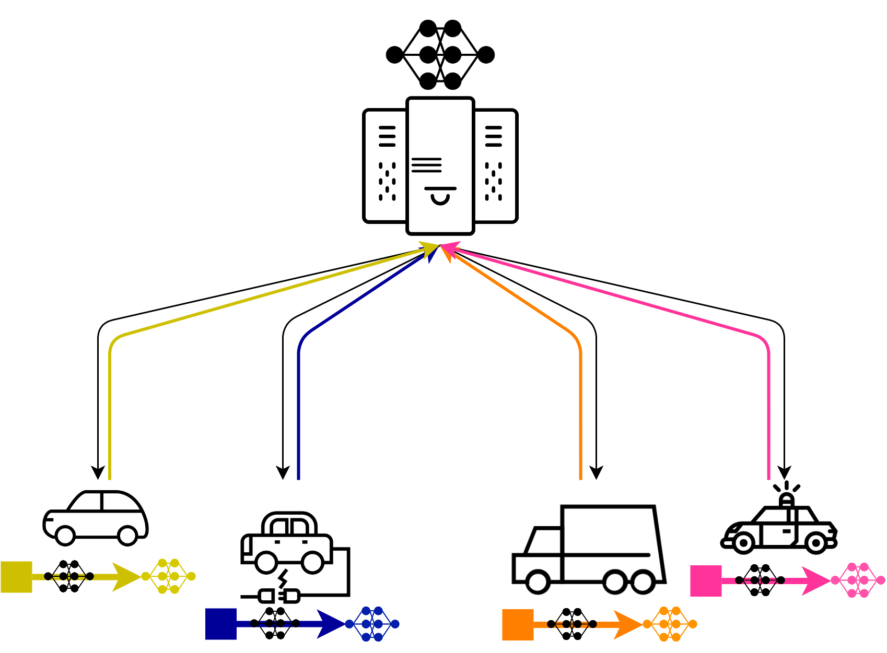

# Overview

**Idea**
- managing many, slightly different models in a distributed setup

**Possible Use Case**
- models in cars, mobile phones, or industrial equipment (turbines, machines, etc.)

**Setting**
- the models are deployed centrally
- but might be updated locally based on new information
- The new model must be known / recoverable by the central server

**Baseline** 
- system that receives and stores all instances of individual models

**Possible Approach**
- local instances could send gradient updates 
- or just pipeline descriptions and raw data, if this is more efficient and deterministically computable

**References**
- elaborate forms of model comparison: MISTIQUE
- basic description of an experiment model that could be used for storing the pipelines: "Schema Paper"
	
## (Possible research) questions
- How does this setting differ to the setting of "data parallel training" of ML models
- Best way to represent/save/transfer model? - Evaluate different strategies in different settings  
- What do we have to save to make a model recoverable? 
- Develop a system architecture/data model to manage multiple different models in a distributed setting 
(Distributed Model Management / Distributed Model Versioning)
-...?
    
## Things to think about in described setting  

### General 
- what assumptions are valid to make?
    - e.g.: every instance has at least:
        - xGB memory available
        - enough computation power to: train model, calc diffs between models, ... 

### Model (update)
- How do we represent the model?
- What needs to be deployed to the cars? 
- What must be sent back to know/recover the model centrally?
- Do we have specialized models form beginning (e.g. slightly different for car model)
- What operations are possible on the target device to get to the final model (relevant if we e.g. only send data +
 (un-/pre-)trained model) 
- How do we calculate the diff between models/gradients?
- Is sending data plus model pipeline more efficient, thank model + weights? 
- Merkle tree for efficient diff of pipelines, weights, ...?

### Data
- How does the data, seen by different instances, varies
- is the data collected at single instances 'biased'
    - daytime - e.g. drives only during night
    - weather - always rain/sun
    - region - only specific country, region, highway vs city
    - ...
- To what extent do we have to store metadata
    - e.g. probably don't need score for every epoch
    
### Instances (e.g. Cars) 
- is a model trained on a specific instance feasible for other cars?
- to what extent are the cars different
    - hardware
    - specific of car influence model performance, training, ...
    - ...

# Related Work

## Reviewed (and relevant)

This is an overview file of related work in the domain of ML Model Managemnt

### MISTIQUE: A System to Store and Query Model Intermediates for Model Diagnosis
- MISTIQUE: **M**odel **I**ntermediate **ST**ore and **QU**ery **E**ngine
- not really *Model Management*, but *Model Intermediate Management*
- Goal: Efficiently capture, store and query **model intermediates** for diagnosis
- **interesting**: techniques to reduce storage footprint, cost models
- [notes](./mistique/README.md)

### Automatically Tracking Metadata and Provenance of Machine Learning Experiments
- **mainly interesting: presented [schema](https://github.com/awslabs/ml-experiments-schema)** 
- lightweight system to extract, store and manage metadata and prove- nance information of common artifacts in machine
 learning (ML) experiments
- tracking: datasets, models, predictions, evaluations and training runs
- [notes](./tracking-meta/README.md)

### On Challenges in Machine Learning Model Management
- **Model Management**: training, maintenance, deployment, monitoring, organization and documentation of machine 
learning (ML) models
- discuss a selection of ML use cases
- **overview of conceptual, engineering, and data-processing related challenges**
- point out future research directions
- [notes](./challanges/README.md)

### ModelDB
- Git like model version control based on research at MIT
- [website](https://www.verta.ai)
- [notes](./modelDB/README.md)

### Scalable Deep Learning on Distributed Infrastructures: Challenges, Techniques, and Tools
- good overview on how to train a model in a distributed setting 
- especially interesting: 
    - describes data parallel training
    - section on Model (Data) Management, ref to ModelDB and ModelHUb
- [pfd](./dystdl/Scalable-Deep-Learning-on-Distributed-Infrastructures-Challenges-Techniques-and-Tools.pdf),
 so far no notes

## Reviewed (not too relevant)

### VisTrails
- [website](https://www.vistrails.org/index.php/Main_Page)
- open-source scientific workflow and provenance management system that supports data exploration and visualization
- last version 05/2016, not maintained anymore  

### Keystone ML
- [Sparks, Evan R., et al. "Keystoneml: Optimizing pipelines for large-scale advanced analytics." 2017 IEEE 33rd 
international conference on data engineering (ICDE). IEEE, 2017.](https://arxiv.org/pdf/1610.09451)
- interesting aspect for us: "Allows users to specify end-to-end ML applications in a single system using high level 
logical operators"
- but operators are way too high-level for our use case 

## To Review TODO
- The Missing Piece in Complex Analytics: Low Latency, Scalable Model Management and Serving with Velox
- Online Model Management via Temporally Biased Sampling
- https://neptune.ai
- An Intermediate Representation for Optimizing Machine Learning Pipelines
- noWorkflow: a Tool for Collecting, Analyzing, and Managing Provenance from Python Scripts
- ModelHub: Deep Learning Lifecycle Management
- Automated Management of Deep Learning Experiments
- Model Selection Management Systems: The Next Frontier of Advanced Analytics
- Rondo: A Programming Platform for Generic Model Management
- Joaquin Vanschoren, Jan N Van Rijn, Bernd Bischl, and Luis Torgo. OpenML: networked science in machine learning. SIGKDD, 15(2):49–60, 2014
- Machine Learning Schema Community Group. W3c machine learning schema, 2017.
- Hui Miao, Ang Li, Larry S Davis, and Amol Deshpande. Towards unified data and lifecycle management for deep learning. In ICDE, pages 571–582, 2017.
- Deep learning model management for coronary heart disease early warning research
- [Reproducibility for Deep Learning](https://www.sciencedirect.com/science/article/pii/S2666389920300933)
- [Deployment and Model Management](https://link.springer.com/chapter/10.1007/978-3-030-45574-3_10)
- [A Programming System for Model Compression](http://learningsys.org/neurips19/assets/papers/16_CameraReadySubmission_WORKSHOP_VERSION_NeurIPS_2019.pdf)
- [How to put machine learning models into production](https://stackoverflow.blog/2020/10/12/how-to-put-machine-learning-models-into-production/?utm_source=Iterable&utm_medium=email&utm_campaign=the_overflow_newsletter)
- [TF - ML Metadata](https://www.tensorflow.org/tfx/guide/mlmd)
- [TF - ML Metadata - get started](https://github.com/google/ml-metadata/blob/master/g3doc/get_started.md)
- [Data Version Control](https://github.com/iterative/dvc)

## Related Research Directions 
from talk by [Manasi Vartak at DEEM](http://deem-workshop.org/videos/2020/7_vartak.mp4)
- Data Versioning
    - version control data similar to code 
    - existing work:
     [OrpheusDB](https://dl.acm.org/doi/abs/10.1145/3035918.3058744?casa_token=aHTGdV87tw4AAAAA:RYB2lh00gt7W3IZxoS4xSjXnljA-6HfAzX7qqhGkBvyLyT863fTm83PoGyGjXIZWRs4QrO0eApg), 
     [Principles of Dataset versioning](https://www.ncbi.nlm.nih.gov/pmc/articles/PMC5526644/),
     [DataHub](https://arxiv.org/abs/1409.0798)
- Data Linage
    - How was a dataset produced
    - existing work:
        - [Sub-zero](https://dspace.mit.edu/handle/1721.1/90854)
        - [ProvDB](http://sites.computer.org/debull/A18dec/p26.pdf)
- Model Debugging 
    - what data is the model predicting correctly vs. incorrectly, why?
    - existing work:
        - [MISTIQUE](./mistique/README.md)
        - Model Assertion (Stanford)
        - Model Diagnosis (UCB)  
- Model & Data Monitoring 
    - is the live model working similar to the offline model 
- Human-in-the-Loop ML
    - improving a model in real-time by annotating, re-training & testing 
    - Interactive Machine Learning
        

 

