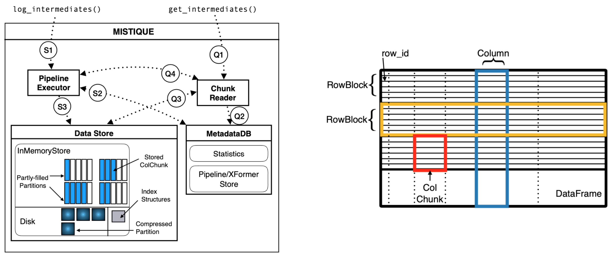

# MISTIQUE: A System to Store and Query Model Intermediates for Model Diagnosis

## General definitions
- **TRAD**: Traditional ML Models with handcrafted features
- **DNN**: Deep neural networks
- **Model Diagnosis**
    - The process of analyzing ML model performance to identify where the model works well and where it doesn’t
- **Categorize diagnostic techniques based on the amount of data required**
    - Few Columns, Few Rows (**FCFR**): "Get the predicted price error for Home-x"
    - Few Columns, May Rows (**FCMR**): "Examine the raw features for the house with the highest prediction error"
    - Many Columns, Few Rows (**MCFR**): "Find training data points that contribute to the prediction of House-X"
    - Many Columns, Many Rows (**MCMR**): "Plot the features of Home-x against the features of allotter houses"

## Focus of paper
- Intermediates that are the intermediate dataset produced by the different stages 
    - TRAD: Outputs produced by every stage of model (OneHotEncode, Feature Eng., Prediction)
    - DNN: Representations produced by every layer
    
## Problem Formulation
- Speeding up diagnostic queries by intelligently choosing: when to re-run a model **vs.** (store and) read an 
intermediate and in turn minimizing the cost of storing intermediates

## Architecture

- MetadataDB
    - Central repo to track metadata about intermediates and pipelines
- Chunk Reader
    - Servicing diagnostic query requests
- Pipeline Executor
    - Run models, register info about model and intermediates at MetadataDB 
    - Store transformers (e.g. models) s.th. we can re-run without re-train
- Data Store
    - Decide whether and how (placement: in memory or not) to store intermediate 
    - Unit of data storage is a Partition: a collection of ColumnChunks, storage decisions are made on that level
    
## Data Store
How to most efficiently store intermediates

### Strategies to reduce storage footprint without compromising query time or accuracy 
- **Quantization and Summarisation**
    - Idea: interested in relative values, not in exact ones
    - *Lower precision float representation*: e.g. store double with float precision, or store float32 ad float16
        - reduces storage: 2x, 4x
    - *k-bit quantization*: representing values using quantiles, given max number of bits for quantiles 
        - reduces storage: o/b
    - *Threshold-based quantization*: only store binary value if over threshold or not
        - reduces storage: o
    - *Pooling* doesn’t store all values but pool them with f.e. max or avg. pooling
        - reduces storage: based on filter size
- **Exact and Approximate De-duplication**
    - Intermediates in ML pipelines often have many identical columns
    - place column chunks with certain similarity in same partition 
    - For NNs: perform exact de-duplication
- **Adaptive Materialization**
    - Pipelines are many stages long, not all intermediates are equally important
    - -> trade-off increase in storage cost due to materialization against resulting speedup in query time

## Cost Model 
- paper presents formulas for (per detailed definition see paper): 
    - time to rerun the model to a certain intermediate
    - time to read a certain intermediate from storage
        - Idea: if time to rerun larger than time to read -> rerun, store otherwise (if possible)
    - storage cost model
        - defines value in seconds/GB (e.g. 1000s/1GB means: developer is willing to use 1GB of storage to save 1000s
         in query time)
    

