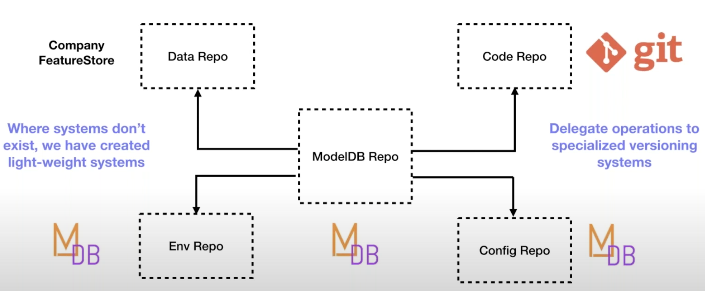

# ModelDB

## ModelDB 1.0: Paper [1] Manasi Vartak et al. (2016, MIT)

- **end-to-end system for the management of machine learning models**
- Model management is the problem of tracking, storing, and indexing large numbers of machine learning models so they
  may subsequently be shared, queried, and analyzed
- Model management provides support for:
    - recapitulate insights
    - sensemaking
    - find trends and perform meta-analyses across models
    - search through models
    - collaboration
- managing models means managing multi-stage pipelines -> manage also:
    - metadata (parameters of pre-processing steps, hyperparameters for models, etc.)
    - quality metrics
    - datasets

### Architecture

- client side
    - native client libraries for:
        - spark.ml
        - scikit-learn
    - frontend: web-based visualization interface
        - review all models and pipelines
        - quickly understand and inspect pipelines
        - comparisons across pipelines and models
- backend
    - defines key abstractions and brokers access to the storage layer
    - stores models and pipelines as a sequence of actions
    - storage layer
        - relational DB
        - custom engine to store and index models
    - **Not described: Any details on used datamodel/schema**

## ModelDB 2.0 - [verta.ai](https://www.verta.ai)

- CEO/Founder: Manasi Vartak (1st Author of ModelDB 1.0 paper [1])
- based on ModelDB 1.0, but completely redesigned [2]
- openSource version on GitHub [3]

Following Content from (8:00-25:00, demo from 32:10): [2]

- Motivation
    - reproducibility of the model (what model, version, hyperparameters, ... were used)
    - better integration of CI/DC tools
    - preservation/sharing of knowledge
    - track progress

- Model Version Control (Git like)
    - manage changes to models over time
        - audit, change logs, immutability
    - uniquely identify model, and the ability to return to it at any time
        - reproducibility, governance
    - Enable multiple data scientists to contribute and reuse
        - collaboration, blame
    - **Why not git?**
        - git not good at handling large files
        - needs to be accessed in code, not cmdline
        - in git every user has full repo (maybe too large)

- ModelDB 1.0 manages
    - Hyperparameters
    - Metadata
    - Pipeline metadata
    - Tags

- ModelDB 2.0
    - git like constructs (commit, fork, merge)
    - metadata tracking as in ModelDB 1.0
    - APIs for applications
    - integration in MLOps

- What is versioned?
    - only "the ingredients"
        - Code
        - Config (i.e. Hyperparameter)
        - Data
        - Environment (e.g. Python version, library versions)
    - weights and checkpoints can be stored as artifacts but are **NOT** part of the model version itself
    - model are serialized here: https://github.com/VertaAI/modeldb/blob/1cf76f128d96a64f86c05ddd4b55d4b8b296be95/client/verta/verta/_internal_utils/_artifact_utils.py#L253      - 

- Architecture
    - modelDB Repo "super repo"
    - every type of data is managed in its own specialized repo (e.g. use git for code versioning)
      

## Sources

- [[1]](https://dl.acm.org/doi/abs/10.1145/2939502.2939516?casa_token=B1-fF_wNvdgAAAAA:pduTz2ZCbgbYHsmOQETTKTtb4QM6Z01VTm52j6sgiOTeU8J_W2kDDoBf06r0-wTctQV9o3ZSgYE)
  Vartak, Manasi, et al. "ModelDB: a system for machine learning model management." Proceedings of the Workshop on
  Human-In-the-Loop Data Analytics. 2016.
- [[2]](https://www.youtube.com/watch?v=U0lyF_lHngo) Vartak, Manasi: "Model Versioning Done Right: A ModelDB 2.0
  Walkthrough"
- [[3]](https://github.com/VertaAI/modeldb) GitHub: VertaAI/modeldb

## Further Research/Questions to answer (if possible):

- what was the data model of modelDB 1.0, what was exactly stored?
- how got modelDB 1.0 the data, active call like in 2.0 or automatic extraction?
- is there a data model for ModelDB 2.0 available (or do we have to extract it from GitHub)
- how does this system differ to a system that we have in mind, why is it (not) possible to use it in our setting?
  (e.g. Cars, Phones, Embedded Systems don't necessarily run Java)    

