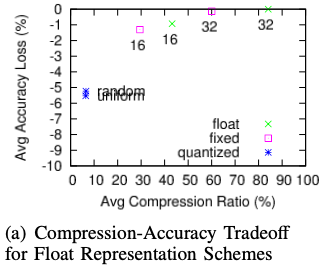
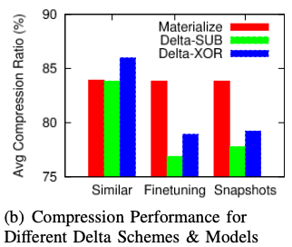

# ModelDB

- Note: These notes are for two related papers, both describing the same system: 
    - both pdfs can be found in this directory

- data and lifecycle management system for deep learning
- design model versioning system similar to git 
- a read-optimized **parameter archival storage system (PAS) that minimizes storage footprint**
- develop efficient algorithms for archiving versioned models using deltas
- demo video can be found [here](https://www.youtube.com/watch?v=4JVehm5Ohg4&feature=youtu.be)

Comment: Mainly interesting about this paper is to take a look at their compression techniques.
So, in the notes, we focus only on this, which makes the following not a good general summary of the paper. 

## Modeling Data Artifacts 
- key data artifact include: 
    - hyperparameters
    - learning measurements 
    - trained snapshots
    - arbitrary files (e.g., hand-crafted files)   

## Model Adjustment
- (a): network architecture adjustments where layers are dropped or added and layer function templates are varied
- (b): hyperparameter selections, which affect the behavior of the optimization algorithms

## Finetuning 
- Similar models are possibly trained and run multiple times, reusing others’ weights as initialization

## Model Version 
- model version(name, id, N, W, M, F)
- name: a human-readable name 
- id: running integer
- N: network definition
    - stored as a DAG of (1) Nodes (layers), and (Edges) connecting the layers
- W: weight values
    - learned parameters (stored in PAS)
- M: extracted metadata
    - provenance info for training and testing
- F: associated files respectively

- **the lineage fo models is captured using a parent relation**

## Parameter archival storage (PAS)
- **centered around the learned parameters, whose storage footprint can be very large**
- focus on not compromising the query performance (**We don't need to set a focus on query performance**)
- widely-used fine-tuning practices generate model versions with similar parameters, resulting
inefficient delta encoding schemes.

## Parameters as Segmented Float Matrices 
### Float Data Type Schemes
- Float point: 32-bit floats (IEEE 754), optional, e.g., TF truncated only 16 bit
- Fixed point: global exponent per matrix (**lossy scheme**)
- Quantization: using only k bits to encode numbers (random or uniform) - most useful for weights that are used for 
fine-tuning or initialization

#####  Bytewise Segmentation for Float Matrices
- high entropy of float numbers makes them very hard to compress
- by exploiting DNN low-precision tolerance (**check what they exactly mean by this**)
    - decompose floating-point numbers and store them bytewise
    - IEEE754 - 32 bit -> 1 bit sign + 8 bit exponent + 23 bit mantissa
    - IDEA: separate higher order and lower order mantissa bits 
    - advantage is the high-order bits have low entropy, and standard compression schemes (e.g., zlib) are effective for
     them
    - **advantage**
        - lower-order bytes can be offloaded to remote storage
        - queries can read only high-order bytes in exchange for tolerating small errors
        

        
### Delta encoding
- parameters from checkpoint snapshots for the same or similar models tend to be close to each other
- idea: **use delta encoding between checkpoints**
    - arithmetic subtraction (Delta-Sub)
    - bitwise XOR (Delta-XOR)
    
##### Experiment

- resulting numbers
    - compressed using zlib
    - **lossless compression (float 32)**

- materialized: fully stored; Delta-Sub and Delta-XOR see above

- similar: latest snapshots across similar models (CNN-S/M/F, VGG-16)
- finetuning: finetuning models (VGG-16, VGG-Salient)
- snapshots: snapshots for the same VGG models in synthetic dataset between iterations
- With fine-tuning and nearby snapshots, the delta is always better, and arithmetic subtraction is consistently better
 than bitwise XOR.

    
### Optimal Parameter Archival Storage 
- address the question of how to best store a collection of model versions so that the total storage footprint occupied
 by the large segmented float, matrices are minimized while the retrieval performance is not compromised.
- recreation/storage trade-off 
- **for now not relevant, extensive explanation in paper**
