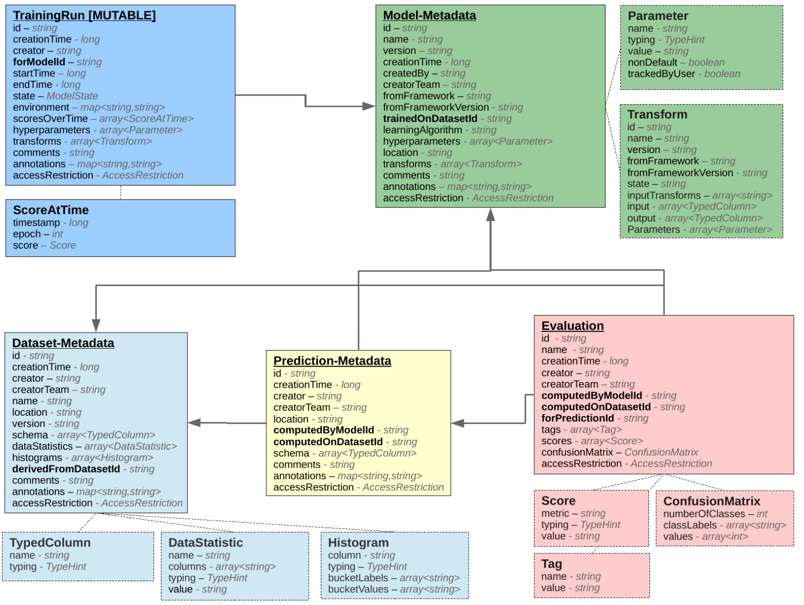

# Automatically Tracking Metadata and Provenance of Machine Learning Experiments

- Schema Design [1]
    - declarability: store metadata of artifacts but not code that produces them -> authors advice: use git
    - immutability: metadata entries are only written once
        - *TrainingRun* only mutable entity
    - **Datset-Metadata**
        - stores metadata for dataset 
        - stores fields like name and version 
        - **only pointer to actual data**
    - **Model-Metadata**
        - reference to input dataset
        - hyperparameters as extra entity 
        - describe the transformation of the data by a graph of Transform entities
            - **do not store parameters only pointers** 
    - **TrainingRun**
        - only mutable entity
        - tracks live execution (e.g. training loss)
    - **Prediction-Metadata**
        - predictions produced by a model

- Simplified version of schema [1]

- Fully Schema [2]

- Schema diff
    - ConfusionMatrix class
    - fields like: *creationTime*, *creator*, *creatorTeam*
    
## Automated Metadata Extraction [1]
- wrote additional code to track pipelines and extract metadata for: 
    - SparkML, scikit-learn, MXNet
    - for now not of great interest (code not available in repo, since paper from 2017 probably not working with 
    the latest versions)

## Sources
- [[1]](http://learningsys.org/nips17/assets/papers/paper_13.pdf): Schelter, Sebastian, et al. "Automatically tracking metadata and provenance of machine learning experiments." Machine Learning Systems workshop at NIPS. 2017.
- [[2]](https://github.com/awslabs/ml-experiments-schema): GitHub: awslabs/ml-experiments-schema (repo for schema)
