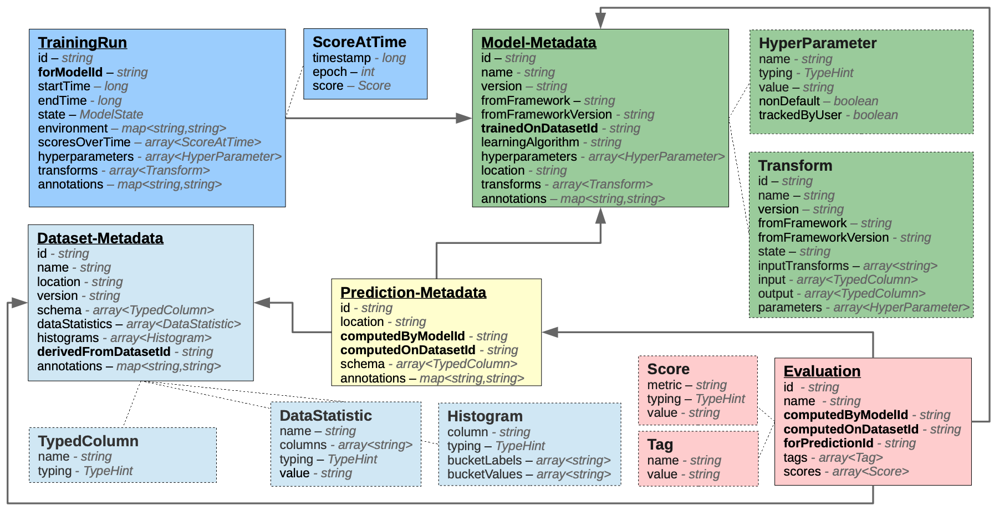

# Automatically Tracking Metadata and Provenance of Machine Learning Experiments

- Simplified version of schema  

- Fully Schema [2]

- Schema diff
    - ...

## Sources
- [[1]](http://learningsys.org/nips17/assets/papers/paper_13.pdf): Schelter, Sebastian, et al. "Automatically tracking metadata and provenance of machine learning experiments." Machine Learning Systems workshop at NIPS. 2017.
- [[2]](https://github.com/awslabs/ml-experiments-schema): GitHub: awslabs/ml-experiments-schema (repo for schema)
